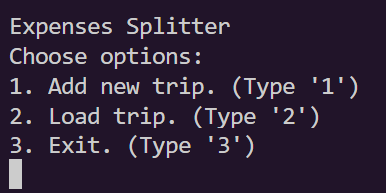
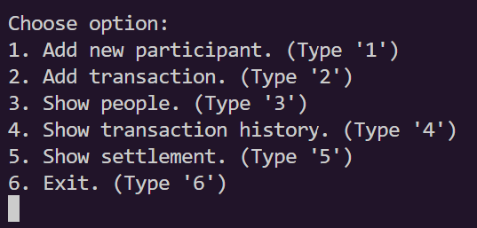
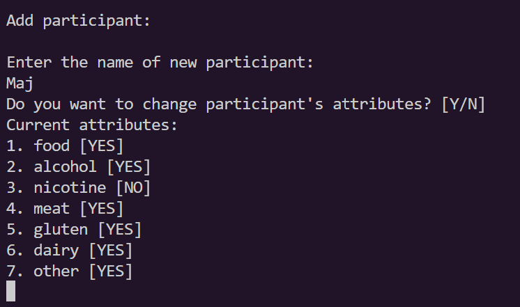
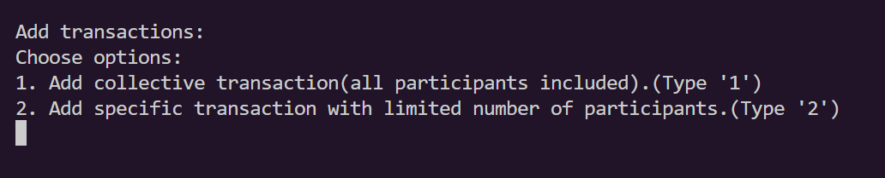
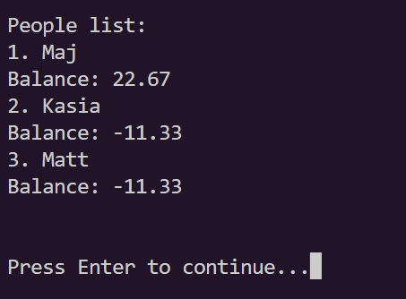
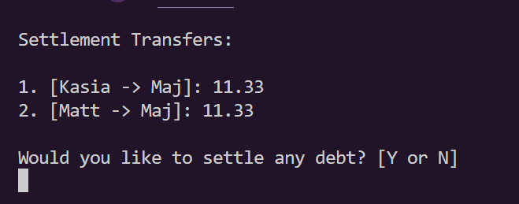

# Expenses Splitter
Console App to manage common expenses on the Trip.

## Launch
Using Make
run in the Expenses-Splitter directory:

`$make`
this will create .o and .out files in your directory. To run app write in the command line:

`$./main.out`

To remove files generated by the complilator run:

`$make clean`

## Introduction

The app enables settling the debts in the group on the Trip. It calculates the depts so that the number of transfers is the tiniest. It was a team project intending to learn the basics of C++. The inspiration was the popular Splitwise app.

## General Info
You can choose whether to create a new Trip or open one from a file in the main menu. Next, you can see the options menu.

You can __add people__ to your Trip and set the categories of payments they will be included in, for example, food, alcohol.

The __add transaction__ option enables you to add the collective transaction, including all trip participants, or the specific transaction, in which you can choose who will participate in the settlement.

The __show people__ option shows you the Trip members' list and current balances.

You can see the history of transactions by choosing Show transactions history option.

The __show settlement__ option gives you the list of transactions necessary to settle all debts. You can choose whether to make a transaction or return to the menu.

## Tests
To run tests, having built the project run in your command line:

`$./file_operations_tests.out`

`$./logic_tests.out`

* __The file operation tests__ consider handling files saved in a specific format. The trip file begins with the trip name, next a list of transactions, and ends with '&&&' symbols.

* __The logic tests__ consider logic and calculating the transactions.

## Improvements for the future

* Saving files in the csv or json format

* Graphic user interface

* Calculating different currencies

